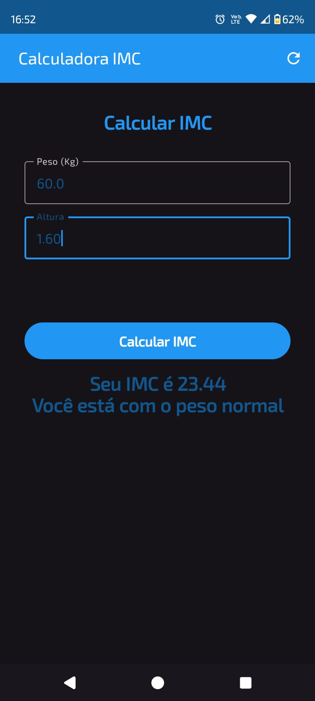

# Calculadora IMC - Jetpack Compose

Este projeto foi desenvolvido com o objetivo de melhorar meus conhecimentos em desenvolvimento Android utilizando o Jetpack Compose.
A aplicação é uma calculadora de IMC (Índice de Massa Corporal) que permite aos usuários inserir seu peso e altura para calcular
seu IMC e exibir uma mensagem correspondente à faixa de IMC.

## Tecnologias Utilizadas

- **Kotlin**: Linguagem de programação principal do projeto.
- **Jetpack Compose**: Framework de UI moderno e declarativo da Google para Android.
- **Material Design 3**: Implementação dos componentes de interface de usuário conforme as diretrizes do Material Design.
- **JUnit**: Biblioteca para testes unitários.
- **Espresso**: Biblioteca para testes de UI.

## Funcionalidades

- Cálculo do IMC com base no peso e altura inseridos pelo usuário.
- Exibição do resultado do IMC e uma mensagem correspondente à categoria de IMC (abaixo do peso, peso normal, sobrepeso, obesidade grau 1, obesidade grau 2, obesidade grau 3).
- Interface de usuário moderna e responsiva utilizando Jetpack Compose.

## Requisitos

- Android Studio Koala ou mais recente.
- JDK 21.
- Conhecimento básico em Kotlin e Jetpack Compose.

## Como Executar o Projeto

1. Clone este repositório:
   ```sh
   git clone https://github.com/seu-usuario/calculadora-imc-jetpack-compose.git
   ```
2. Abra o projeto no Android Studio.
3. Sincronize as dependências do Gradle.
4. Execute o aplicativo em um dispositivo ou emulador Android.

## Imagens do App

Aqui estão algumas capturas de tela do aplicativo

<p align="center">
    
    
</p>

## Contribuição

Sinta-se à vontade para contribuir com este projeto. Você pode abrir issues para relatar bugs ou sugerir melhorias, e também pode enviar pull requests.

### Contato

- **Nome**: Marcelo Souza
- **Email**: marcelocaregnatodesouza@gmail.com
- **LinkedIn**: [meu-linkedin](https://www.linkedin.com/in/marcelosouza-1999/)